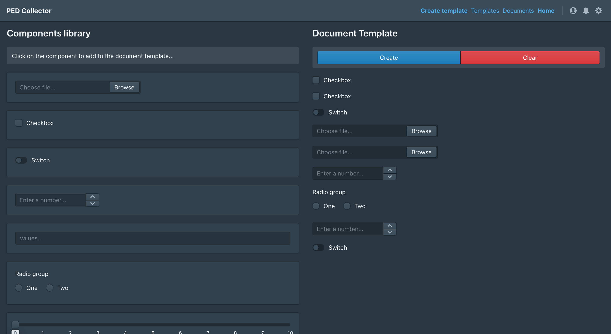

# PEDC-WI

__Status__: proof-of-concept

A web interface for a pre-experimental data collector.
 


### Start local development 

Run the commands sequentially:

```
yarn install
yarn start
```

Open [http://localhost:3000](http://localhost:3000) to view it in the browser.

### Build

Run the command:

```
yarn build
```

### Additional requirements

In devWorks with backend running on [http://localhost:4000](http://localhost:4000)
(`proxy` is configured in package.json) - https://github.com/hereon-wpi/pedc-back

### Architecture

See in [ARCHITECTURE.md](docs/ARCHITECTURE.md)
