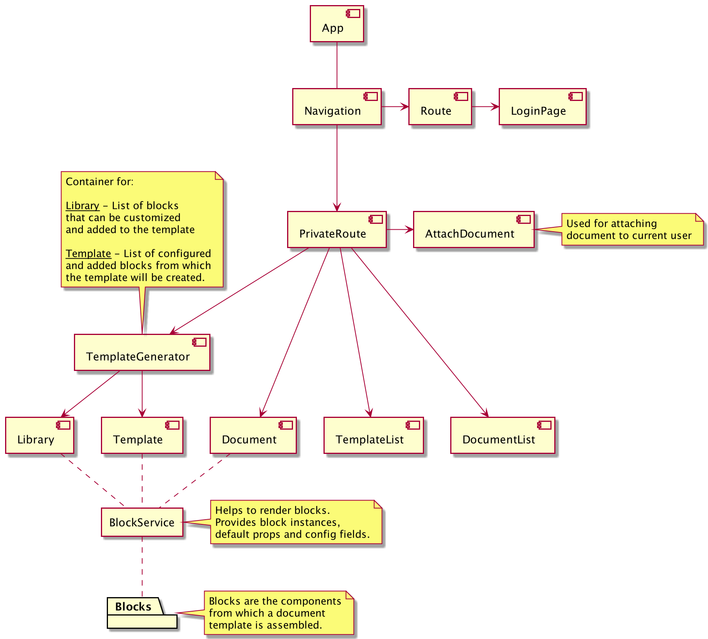

# Application architecture

### Folder structure

```
src
│
├── api         - services to work with API
│
├── blocks      - blocks to fill template
│ 
├── components  - components used in pages
│
├── pages       - pages with business-logic
│
└── state       - application state
```

### Components scheme



### Auth scheme


